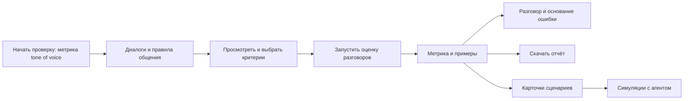

# Проверка tone of voice

Основной пользователь отвечает за качество общения агента. Он начинает с готовой выгрузки разговоров и правил
коммуникаций и заканчивает метрикой, примерами ошибок и отчётом. Вызов агента для этого сценария не нужен.
Это начальный участок общего процесса Agent Lab: дальше из оценки собираются карточки сценариев и запускаются
симуляции. На демо пользователь останавливает показ на метрике. Все разделы работают с общими данными;
отдельной демоверсии или отдельного набора активных данных нет.

## Экраны

| Экран | Тип | Что видно первым | Главное действие | Продолжение |
|---|---|---|---|---|
| `/start` | Начало работы | Выбор метрики (tone of voice или точность), что для неё уже есть, конвейер до симуляций | Начать или продолжить | Материалы |
| `/check?step=materials` | Форма | Загруженные разговоры и текст правил | Собрать критерии | Критерии |
| `/check?step=criteria` | Выбор | Имена критериев, исходные коды, количество выбранных | Запустить проверку | Оценка |
| `/check?step=checking` | Состояние задачи | Число проверенных разговоров из выборки | Остановить | Результат или повтор |
| `/check?step=result` | Итог | Компактная метрика, частая находка с цитатой и основанием | Подтвердить или оспорить | Редактура, уточнение, отчёт, история |

Материалы на широком экране стоят рядом, на узком — разговоры перед правилами. Критерии читаются вертикальным
списком; длинное требование, исключения и цитата раскрываются в строке. В результате цитата и ответ человека
находятся на одном экране; исходный документ и исключения раскрываются рядом. Используются существующие
`Header`, `Button`, `Modal`, `Sheet`, `Skeleton`, `Conversation` и токены проекта.

## Состояния и восстановление

| Состояние | Поведение |
|---|---|
| Нет материалов | Два ясных поля; переход отключён до загрузки разговоров и правил |
| Ошибка файла | Причина рядом с формой; текущая выгрузка не изменяется при ошибке чтения |
| Есть предыдущая оценка | Замена входных данных требует подтверждения; сохранённые проверки и симуляции остаются; новая выгрузка сохраняет критерии и уточнения при неизменном источнике |
| Код агента прочитан заново | Правила общения, их критерии с уточнениями и итог проверки остаются: это не код агента |
| «Оценить заново» в «Диалогах» | Ведёт к шагу «Критерии» этой проверки; оценка диалогов по коду агента её критерии не берёт |
| Сборка критериев | Видимый статус; отмена не публикует незавершённый перечень |
| Перерывы | Выгрузка, активные правила, критерии и итог сохраняются на сервере; текст в форме — в сессии вкладки |
| Потеря связи | Сохранённые данные остаются видимыми; есть повтор подключения |
| Модель недоступна | Непроверенные разговоры не становятся успешными; показаны повтор и настройки. Если модель не ответила ни по одному разговору, проверка не публикуется: прежний итог, сценарии и история остаются |
| Все критерии сняты | Запуск недоступен до выбора хотя бы одного |
| Не хватило данных | Отдельный исход «не удалось оценить», не входящий в знаменатель |
| Права | Текущий локальный продукт использует одну рабочую область, без новых ролей и разрешений |

## Данные и метрика

- Разговоры: существующая загрузка `.xlsx` / `.jsonl`, `POST /api/logs`.
- Правила: текст, `.docx`, `.txt`, `.md`; просмотр файла не меняет текущую оценку.
- Готовый рубрикатор с кодами собирается без модели. Повторяющиеся секции одного кода объединяются,
  примеры и инструкция о формате ответа не превращаются в дополнительные критерии. Исключения сохраняются.
  Требование читается без заголовка секции («### pronouns»); цитата сохраняет его дословно.
- Для свободного текста модель выделяет критерии только с проверяемой цитатой из источника.
- Оценка использует существующий механизм проверки записанных разговоров; модель не общается с агентом.
- Метрика — доля разговоров без найденных ошибок среди разговоров, по которым удалось вынести оценку.
  Она показывается вместе с `N из M`, размером выборки и числом разговоров без оценки.
- Если часть выбранных критериев осталась `UNKNOWN`, разговор не считается успешной проверкой tone of voice.
  Явная ошибка имеет приоритет над неопределённостью. Неприменимые требования не становятся ошибками.
- Это оценка общения по выбранным правилам; точность самого оценщика подтверждается отдельно человеческой разметкой.

## От находки к следующему действию

- Находки упорядочены по числу разговоров с ошибкой. У каждой — свой знаменатель, реальная реплика,
  объяснение и переход к полному разговору. Можно подтвердить, оспорить или отменить ответ.
- «Как можно переформулировать» открывает явный запрос модели. Предложение не меняет разговоры или метрику;
  пользователь проверяет сохранность смысла. Числа и электронные контакты дополнительно проверяются сервисом.
- После оспаривания можно описать допустимую ситуацию. Модель предлагает уточнение; человек редактирует
  и сохраняет его отдельно от исходного документа. Новая версия не пересчитывает прошлую оценку автоматически.
- Короткий отчёт содержит до трёх частых проблем, фрагменты доказательств, состояние человеческой проверки
  и следующее действие. Полное основание доступно в сохранённой проверке. Отчёт можно просмотреть, скопировать
  или скачать; чтение не вызывает модели.
- Каждый завершённый новый прогон ToV сохраняется атомарно с исходными разговорами, выбранными критериями и
  текстом документа. Человеческие отметки хранятся отдельно и переживают новые загрузки. Старые результаты,
  созданные до этой функции, явно отмечаются как ещё не вошедшие в историю.
- История доступна со старта и результата. `/start?history=<id>` открывает конкретный снимок даже после замены
  материалов. При одинаковых критериях и моделях различаются повторная оценка тех же разговоров и новая выборка;
  при изменении критериев или моделей численная разница не показывается.
- Устаревшие версии, ошибки сети и недоступные модели оставляют понятный путь к обновлению или повтору.
- Переход «Дальше — сценарии и симуляции» ведёт на существующий экран сценариев. Он не вызывает модели.
  На экране доступны явная сборка карточек и дальнейший запуск с выбранным агентом. Уточнения критериев
  сохраняются в карточках; новая оценка сбрасывает устаревшую текущую колоду, сохраняя историю прогонов.

## Визуальные состояния

Применяются токены проекта: `canvas` / `inset` для поверхностей, `fg` / `fg-3` для иерархии, `line` для разделения,
`primary` для следующего действия, `bad` для ошибок, `ok` для подтверждения загрузки, `run` для ссылок и фокуса.
Один основной чёрный CTA на шаг; без новых порогов качества и меток тяжести. Шрифт и шкала остаются из DESIGN.md.
