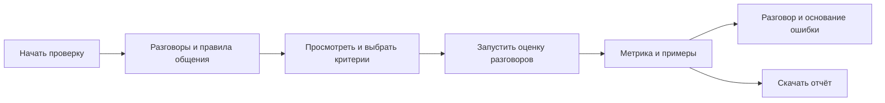

# Проверка tone of voice

Основной пользователь отвечает за качество общения агента. Он начинает с готовой выгрузки разговоров и правил
коммуникаций и заканчивает метрикой, примерами ошибок и отчётом. Вызов агента для этого сценария не нужен.
Существующая рабочая область с кодом агента, источниками, симуляциями и ручной проверкой остаётся доступна.

## Экраны

| Экран | Тип | Что видно первым | Главное действие | Продолжение |
|---|---|---|---|---|
| `/start` | Начало работы | Что проверим и какие два материала нужны | Начать или продолжить | Материалы |
| `/check?step=materials` | Форма | Загруженные разговоры и текст правил | Собрать критерии | Критерии |
| `/check?step=criteria` | Выбор | Имена критериев, исходные коды, количество выбранных | Запустить проверку | Оценка |
| `/check?step=checking` | Состояние задачи | Число проверенных разговоров из выборки | Остановить | Результат или повтор |
| `/check?step=result` | Итог | Процент и точный знаменатель, затем три исхода | Посмотреть разговоры | Разбор, ручная проверка, отчёт |

Материалы на широком экране стоят рядом, на узком — разговоры перед правилами. Критерии читаются вертикальным
списком; длинное требование, исключения и цитата раскрываются в строке. Процент, три исхода и следующий шаг
видны до списка проблем. Используются существующие `Header`, `Button`, `Modal`, `Skeleton`, `ProblemList`.

## Состояния и восстановление

| Состояние | Поведение |
|---|---|
| Нет материалов | Два ясных поля; переход отключён до загрузки разговоров и правил |
| Ошибка файла | Причина рядом с формой; текущая выгрузка не изменяется при ошибке чтения |
| Есть предыдущая оценка | Замена входных данных требует подтверждения; сохранённые симуляции остаются |
| Сборка критериев | Видимый статус; отмена не публикует незавершённый перечень |
| Перерывы | Выгрузка, активные правила, критерии и итог сохраняются на сервере; текст в форме — в сессии вкладки |
| Потеря связи | Сохранённые данные остаются видимыми; есть повтор подключения |
| Модель недоступна | Непроверенные разговоры не становятся успешными; показаны повтор и настройки |
| Все критерии сняты | Запуск недоступен до выбора хотя бы одного |
| Не хватило данных | Отдельный исход «не удалось оценить», не входящий в знаменатель |
| Права | Текущий локальный продукт использует одну рабочую область, без новых ролей и разрешений |

## Данные и метрика

- Разговоры: существующая загрузка `.xlsx` / `.jsonl`, `POST /api/logs`.
- Правила: текст, `.docx`, `.txt`, `.md`; просмотр файла не меняет текущую оценку.
- Готовый рубрикатор с кодами собирается без модели. Повторяющиеся секции одного кода объединяются,
  примеры и инструкция о формате ответа не превращаются в дополнительные критерии. Исключения сохраняются.
- Для свободного текста модель выделяет критерии только с проверяемой цитатой из источника.
- Оценка использует существующий механизм проверки записанных разговоров; модель не общается с агентом.
- Метрика — доля разговоров без найденных ошибок среди разговоров, по которым удалось вынести оценку.
  Она показывается вместе с `N из M`, размером выборки и числом разговоров без оценки.
- Если часть выбранных критериев осталась `UNKNOWN`, разговор не считается успешной проверкой tone of voice.
  Явная ошибка имеет приоритет над неопределённостью. Неприменимые требования не становятся ошибками.
- Это оценка общения по выбранным правилам; точность самого оценщика подтверждается отдельно человеческой разметкой.

## Визуальные состояния

Применяются токены проекта: `canvas` / `inset` для поверхностей, `fg` / `fg-3` для иерархии, `line` для разделения,
`primary` для следующего действия, `bad` для ошибок, `ok` для подтверждения загрузки, `run` для ссылок и фокуса.
Один основной чёрный CTA на шаг; без новых порогов качества и меток тяжести. Шрифт и шкала остаются из DESIGN.md.
